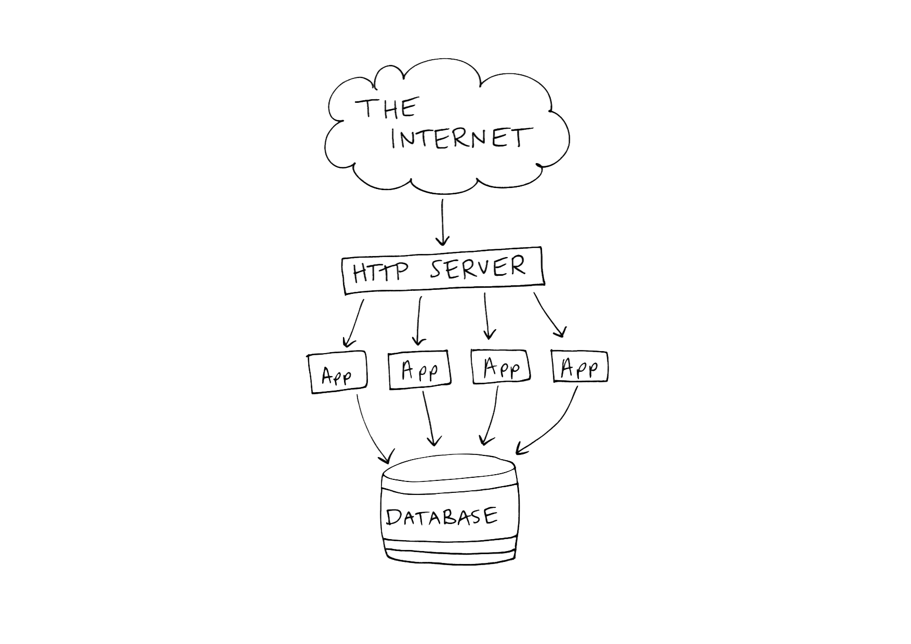

text-strong: #0f98af
header-emphasis: #0f98af
header-strong: #0f98af
text-emphasis: #0f98af
code: Consolas

# Software For The Internet
## **With Phoenix**
<br>
### Kira McLean

_twitter.com/kiraemclean_
_github.com/kiramclean_

---

# About Me

^ A community group of people teaching themselves how to code through online courses and meetups.. how I learned to code and I love helping other poeple see how much fun it can be. And how accessible it is.

   
 

---

# About Me

   
  

---

**Elixir** → language

^ Elixir is a functional programming language that runs on the Erlang VM. It first appeared in 2011 and v1 was released in 2014. It was developed by Jose Valim, a rails core contributor, alledgedly out of his frustrations trying to make ruby apps handle concurrency. It's gaining popularity and used by some big companies for parts of their apps, including Pinterest, Moz, Bleacher Report, Brightcove. 

^ Supported on many platform-as-a-service providers, like Heroku, Engine Yard, Digital Ocean, you can also deploy a container to AWS or or Google Container Engine, so there are apps running this in production.

   

---

**Elixir** → language

**Erlang** → also language, has own VM ("The BEAM")

^ Elixir compiles to Erlang byte code and runs on the Erlang VM (the BEAM). Erlang is a functional language developed in the 80s by Ericsson for use in the telecom industry.

^ Also lots of companies use Erlang for parts of their apps, like Heroku, WhatsApp, RabbitMQ.

   

---

**Elixir** → language

**Erlang** → also language, has own VM ("The BEAM")

**Phoenix** → web framework

^ Phoenix is a web framework written in Elixir. It's a full stack framework (comes with great front-end tooling and a database abstraction layer). It's similar to other MVC frameworks, although it doesn't really have "models" because Elixir is functional. So it's like Rails (Ruby), sort of like express (NodeJS), Django (Python), Play (Java/Scala). 

^ So, Phoenix and Elixir are new, but Erlang is relatively old and proven to be reliable for highly concurrent apps at scale. Elixir is just Erlang byte code, so you don't need to take much of a leap of faith to trust it.

   

---

> Scaling web apps is hard.

^ I'm a web developer. I do mostly Ruby on Rails, also front-end stuff with different JavaScript frameworks. I haven't been doing it for that long, but I noticed that you quickly start to run to the same problems with web apps over and over again, especially when you try to scale them.

^ Building CRUD apps is really easy now, but most of our time is not spend in the CRUD-y parts of a web app, it's spent developing all the stuff behind the web interface, where all the business rules live.

^ There are some fundamental challenges in web development because of the nature of the internet and user expectations and Phoenix was built in some ways to address some of these problems. It's able to offer some unique solutions to these problems because of the Elixir language and the underlying Erlang VM. This is a talk about how Phoenix brings a new approach to solving some common chanllenges in web development.

---

# Web Apps

- 1. Distributed

^ One hard thing about web development is that you have many people asking for many things from different places at the same time.

^ Some of your code runs on your server, some of your code runs on your users' browsers, some of it might live in a CDN. Even if you only have one web server, web apps are distributed by their nature. The code you write is running across tons of different machines.

---

# Web Apps

- 1. Distributed
- 2. Stateful

^ A stateful app is one that changes as you interact with it. It's like it remembers who you are and what you were doing. Like when you login to reddit, then visit a different sub-reddit, you're still logged in as yourself. When you add something to your cart in amazon then go to the checkout page, it's still there in your cart. 

---

# Web Apps

- 1. Distributed
- 2. Stateful
 
#  ☹️

---

### Fundamental Problem:

## Stateful apps communicating over a stateless protocol

^ HTTP is a stateless protcol, but people expect a stateful experience. That means that everytime you make an HTTP request, you have to send all the data required to fulfill the request. The server doesn't remember anything about the last time you asked it for something. It's like it's the first time it's ever heard about you every time.

^ That also means that your code does not persist state between requests. Once your server is done responding to a request, it throws out all the stuff it loaded into memory for it.

---

# To Deal With It

- 1. Concurrency

^ Have to make your server handle many things at the same time. You have to do a lot of things for each request to build the web page your user is asking for (like calling external APIs or internal microservices to get information), plus you have tons of users asking for different stuff at the same time.

^ Doing all these things at once means you have to make your code handle concurrent execution. You will want to do some things things that take longer than others, and if you're running all the requests in the order they come in, you'll end up with something fast stuck behind something slow, which will jam up your app.

---

# To Deal With It

- 1. Concurrency
- 2. Persistence

^ Somehow you have to remember things about your users between requests

---

# Current Solution

- 1. Concurrency → **Operating System**
- 2. Persistence

^ Current solution is basically delegate to the operating system. If you need your server to handle many things at the same time (in a Rails app, for example), you spin up multiple ruby processes and punt the responsibility of making full use of system resources to the operating system. This is ok, operating systems are really good at switching between processes. Your code has no shared global state (right?), because it's stateless, so it shouldn't matter which process ends up handling which request -- you just leave it to the operating system to schedule.

---

# Current Solution

- 1. Concurrency → **Operating System**
- 2. Persistence → **Database**

^ We store state in databases and transmit it with cookies to simulate a stateful experience for the user, but this adds complexity, like constantly querying the DB for every request, because everybody needs to access the same database to make sure the data is consistent.

---



---

# Scaling This Solution

- More processors

^ Because your server is stateless and you're getting stateless requests, you can just keep spinning up more processes to handle more requests. Then when your machine runs out out of processing power, you can get a bigger machine

---

# Scaling This Solution

- More processors
- More machines

^ Then when that machine runs out out of processing power, you can get _more_ machines.

---

# Scaling This Solution

- More processors
- More machines

# 🤑

^ This works and it's the architechture of most of the web, but it's not ideal for the web. It's a solution sort of built for traditional programming languages and databases and sqeeuzed and stretched to accommodate the web.

---

# Recap

---

# Recap
## Web Apps Are:

---

# Recap
## Web Apps Are:

- Distributed 
- Highly concurrent
- Stateful

---

# Recap
## Web Apps Are:

- Distributed 
- Highly concurrent
- Stateful

# 🤔 

---

 

^ It turns out this problem has already been solved

---

> Elixir's Concurrency Model 

---

> Elixir's Concurrency Model 

# Actor Model

---

# Actor Model

- Super lightweight VM **processes**
<br>

```elixir
iex> spawn(fn -> IO.puts("Hello from process") end)
Hello from process
#PID<0.82.0>
```

^ In Elixir anything can run in a process

---

# Actor Model

- Each process has it's **own mail box**
<br>

```elixir
iex> send(self(), {:hello, "A message for my mailbox"})
{:hello, "A message for my mailbox"}

iex> receive do
...>   {:hello, message} -> message
...> end
"A message for my mailbox"
```

^ You send messages with `send/2` and receive them by pattern matching on messages with `receive`

---

# Actor Model

- Interact with each other **only** by sending messages to each others' mail boxes

```elixir
iex> parent = self()
#PID<0.83.0>

iex> spawn(fn -> send(parent, {:hello, self(), "a message for you"}) end)
#PID<0.108.0>

iex> receive do
...>   {:hello, pid, message} -> "Got message: '#{message}' from #{inspect(pid)}"
...> end
"Got message: 'a message for you' from #PID<0.108.0>"
```

^ It's "best practice" in OO to communicate only by sending messages, but it's easy to be undisciplined and reach into other objects to access data that you shouldn't be accessing.

^ You send a message to a known `pid` with `send`. Messages are also location transparent, so the `pid` can be on another node.

---

# Actor Model

- Messages are **sent asynchronously** _but read sequentially_

```elixir
iex> parent = self()
#PID<0.83.0>

iex> numbers = Enum.to_list(1..1000)
[1, 2, 3, 4, 5, 6, 7, 8, 9, 10, 11, 12, 13, 14, 15, 16, 17, 18, 19, 20, 21, ...]

iex> numbers |>
...>   Enum.map(&(spawn(fn -> send(recipient, {:hello, "this is message ##{&1}"}) end))
[#PID<0.349.0>, #PID<0.350.0>, #PID<0.351.0>, #PID<0.352.0>, #PID<0.353.0>, ...]
```

^ Also, in OO message sending is (usually) synchronous (you send a message, wait for the response, then continue). In Elixir you have no control over when your message gets read. All you can do is put it in the other process' mailbox.

---

# Actor Model

- Messages are _sent asynchronously but_ **read sequentially**

```elixir
iex> flush()
{:hello, "this is message #1"}
{:hello, "this is message #2"}
{:hello, "this is message #3"}
# ...
{:hello, "this is message #8"}
{:hello, "this is message #10"}
{:hello, "this is message #9"}
# ...
{:hello, "this is message #20"}
{:hello, "this is message #22"}
{:hello, "this is message #21"}
{:hello, "this is message #23"}
{:hello, "this is message #25"}
{:hello, "this is message #24"}
{:hello, "this is message #26"}
{:hello, "this is message #27"}
{:hello, "this is message #29"}
{:hello, "this is message #28"}
#...
```

^ A process is a sequential thread of execution. All the messages in a mailbox are read in the order they came in, one at a time

---

# Actor Model

- Processes run **concurrently**

```elixir
defmodule Slow do
  def concurrent(delays) do
    recipient = self()
    delays
    |> Enum.map(&(spawn(fn -> send_message(&1, recipient) end)))
    |> Enum.map(fn pid -> receive_message(pid) end)
  end

  defp send_message(delay, back_to_caller) do
    :timer.sleep(delay)
    send(back_to_caller, {self(), "Waited #{delay}ms"})
  end

  defp receive_message(pid) do
    receive do
      {^pid, message} -> {pid, message}
    end
  end
end
```

---

# Actor Model

- Processes run **concurrently**

```elixir
delays = for _ <- 1..1000 do [] ++ Enum.random(100..2500) end

defmodule Timing do
  def time_this(delays) do
    before = System.monotonic_time(:millisecond)
    Slow.concurrent(delays)
    later = System.monotonic_time(:millisecond)
    (later - before) / 1000
  end
end

iex> Timing.time_this(delays)
2.503
```

^ It only takes as long as the slowest call (with very little overhead for 1000 processes)

---

# Actor Model

- Memory is **isolated** to each process

```elixir
iex> me = self()
#PID<0.83.0>

iex> new_process = spawn(fn -> raise "Uh oh" end)
#PID<0.120.0>

iex>
15:24:37.039 [error] Process #PID<0.120.0> raised an exception
** (RuntimeError) Uh oh
    (stdlib) erl_eval.erl:668: :erl_eval.do_apply/6

iex> Process.alive?(new_process)
false

iex> Process.alive?(parent)
true
```

^ An elixir process can make decisions about itself and change its own state, can spawn more processes, and can send messages to other processes, that's pretty much it.

---

# More Than Processes

- State?
- Linking?

^ These processes are just one-off threads of execution, what if you need to remember something? What happens if one dies?

---

# More Than Processes

- State? → **`Agent`**
- Linking?

^ Processes can run for as long as you want, so they can have internal state. Data is immutable in Erlang, but you can persist state in a process through recursion. So you can take some state into your function, do some things to it, then call yourself with the result, and like this you can recurse forever, as long as you make sure your functions are tail-recursive so elixir will optimize them to free up memory after they recurse.

^ Agents are just processes with that call themselves with their own result (the updated state)

---

# More Than Processes

- State? → **`Agent`**
- Linking? → **`Task`**

^ Can link processes together so they receive exit notifications from each other (`spawn_link`)

^ Can monitor a spawned process if you want updates but don't want to crash if the monitored process crashes (`spawn_monitor`)

^ Tasks are also just processes but some of the stuff required to monitor and link them is abstracted away. They provide a way to execute functions in the background and retrieve the result later.

---

# More Than Processes

- State? → **`Agent`**
- Linking? → **`Task`**
- Both?

---

# More Than Processes

- State? → **`Agent`**
- Linking? → **`Task`**
- Both? → **`GenServer`**

^ GenServers maintain state and manage linking and monitoring. `GenServer`s are just processes, like everything else in elixir/erlang, with some of the behaviours you want abstracted up a couple of levels. Like all the other processes, all you can do to them is send them a message. With `GenServer`s you can either send a message synchronously (call), meaning you're expecting a reply from the server, or asynchronously (cast), meaning you don't care about the results.

^ A `GenServer` can receive your message, keep track of it, and reply to it

---

# More Than Processes

- State? → **`Agent`**
- Linking? → **`Task`**
- Both? → **`GenServer`**
- Monitoring?

^ GenServer can monitor processes and keep track of them, but what if the GenServer crashes?

---

# More Than Processes

- State? → **`Agent`**
- Linking? → **`Task`**
- Both? → **`GenServer`**
- Monitoring? → **`Supervisor`**

^ `Supervisor`s monitor other processes and know how to restart them if they crash, and when to restart them. Supervisors can also be supervised, so you can have an app that is just a big supervision tree with workers at the 

---

More Than Processes

- State? → **`Agent`**
- Linking? → **`Task`**
- Both? → **`GenServer`**
- Monitoring? → **`Supervisor`**

# [fit] **>** OTP

^ All of these concurrency abstractions, plus tons of other things, make up the Open Telecom Platform. 

---

> New Possibilities for the Web

---

# Alternative Solution

- 1. Concurrency
- 2. Persistence

---

# Alternative Solution

- 1. Concurrency → **Erlang VM**
- 2. Persistence

^ Instead of delegating concurrency to the operating system, Erlang can handle it

^ Erlang handles scheduling all of these processes and passing messages between them, and it's really good at it. Erlang processes are super fast to spawn and don't consume a lot of memory (like a few hundred bytes)

---

# Alternative Solution

- 1. Concurrency → **Erlang VM**
- 2. Persistence → **The OTP** 

^ 30 years of iterating on best practices for maintaining state in fault-tolerant, distributed systems

---

> Common Challenges

^ I want to look at some common problems we deal with in web development today that are hard because of the limitations of the architechture we talked about at the beginning, and that might be easier to solve with Phoenix, because it's able to use processes and leverage the power of the BEAM.

---

## _1._ Slow Requests
## _2._ **Caching**
## _3._ Sharing Data
## _4._ **Error Handling**

^ These are sort of key things your app has to be able to do, and these are things I've found to be hard as a web app grows.

^ 1. Handle slow requests in a way that doesn't block the app for everyone else and makes sense for the current user.

^ 2. Access the same data at the same time from different places

^ 3. Store the result of expensive or rate-limited requests

^ 4. Error handling in a minimally invasive way

---

## _1._ Slow Requests

^ How you fix them depends on what's causing them

---

## _1._ Slow Requests
### _Problem:_ Doing Too Much Work

^ If someone has to do a big import or export, creating reports, stuff like that. Usually it's things that touch a lot of data.

---

# _1._ Slow Requests

- _Before:_ Background Jobs

---

# _1._ Slow Requests

- _Before:_ Background Jobs
<br>

```ruby
# in an imports controller somwhere

def create
  import_options = parse_some_incoming_params
  # send to a separate worker process to deal with
  SlowImportJob.perform(import_options)
  send_the_user_somewhere
end
```

---

# _1._ Slow Requests

- _Before:_ Background Jobs
<br>

```[.highlight: 5-6] ruby
# in an imports controller somwhere

def create
  import_options = parse_some_incoming_params
  # send to a separate worker process to deal with
  SlowImportJob.perform(import_options)
  send_the_user_somewhere
end
```

^ Requires external job queue (Sidekiq/Resque, in Ruby)

^ Requires polling the job to check its status

^ All jobs still run sequentially in your worker(s)

^ All steps in that job still run sequentially (unless you send _those_ to other workers)
  
^ You may still need many workers to handle a lot of these jobs if you have 100 people trying to do this at once. You might not be waiting for a response in the UI anymore, but you will still need multiple queues to make sure a slow job doesn't back up all the other faster jobs you're trying to do async.

---

# _1._ Slow Requests

- _Before:_ Background Jobs
- _After:_ Elixir Processes

^ In Phoenix, you can just use elixir processes for these. Like we saw earlier, there are tons of built-in libraries to handle concurrent processing, linking and monitoring tasks. 


---

# _1._ Slow Requests

- _Before:_ Background Jobs
- _After:_ Elixir Processes
<br>

```elixir
def create(conn, %{"import" => import_params}) do
  Task.Supervisor.async_nolink(MyApp.TaskSupervisor, fn ->
    BulkImport.create(import_params)
  )
  send_user_somewhere
end
```

^ You can have as many of these as you want  

---

# _1._ Slow Requests

- _Before:_ Background Jobs
- _After:_ Elixir Processes
<br>

```[.highlight: 2] elixir
def create(conn, %{"import" => import_params}) do
  Task.Supervisor.async_nolink(MyApp.TaskSupervisor, fn ->
    BulkImport.create(import_params)
  )
  send_user_somewhere
end
```

^ The task can finish on its own after the request is complete, it's supervised so it will be restarted automatically.

^ There are also libraries for elixir you can use if you need some more advanced features, like job prioritization, concurrency limiting, compatibility with sidekiq.

---

## _1._ Slow Requests
### _Problem:_ Waiting on Too Many Things

---

# _1._ Slow Requests

```ruby
# in a checkouts controller

def new
  @tax_rate = fetch_tax_rate
  @shipping_rate = fetch_fedex_shipping_rate
  @other_shipping_rate = fetch_local_carrier_shipping_rate
  run_through_fraud_detection
  reserve_items_in_cart
  render :new
end
```

---

# _1._ Slow Requests

- _Before:_ Async Javascript

---

# _1._ Slow Requests

- _Before:_ Async Javascript

```[.highlight: 1, 9, 14] js
xmlRequest.onreadystatechange = function() {
  if (xmlRequest.readyState === XMLHttpRequest.DONE) {
    if (xmlRequest.status === 200) { result = xmlRequest.responseText } 
    else if (xmlRequest.status === 400) { alert("Something went wrong") } 
    else if (...) { alert("Something bad happened") }
  }
}

xmlRequest.onloadend = function() {
  document.querySelector(".my-dom-element").innerHTML = xmlRequest.responseText
}

xmlRequest.open("GET", "http://someapi.com/endpoint", true) // true means async
xmlRequest.send()
```

^ Client-side authentication is hard (when you want just clients talking to clients wtihout going through your server). A lot of solutions go through your server, where the API secret is safely stored, but then you're just back where you started with all the pitfalls of your slow server.

^ Firing off AJAX requests like this makes it hard to maintain a valid session state, because you can't know what order the responses will come in. The session is half of the key to how we simulate state in this architechture.

^ Can do something similar like this server-side too with Node or Ruby (Event Machine), but concurrency model is the Reactor pattern, where everything runs in a single-threaded event loop, so although you can leverage the concurrent nature of external systems like the internet or your DB and multiplex IO, now you have to write your code in a convoluted callback style and you are not taking advantage of multi-core machines. 

---

# _1._ Slow Requests

- _Before:_ Async Javascript
- _After_: Elixir Processes

---

```elixir
def new(conn, %{"some_param" => some_param}) do
  tax_rate = Task.async(fn -> TaxService.find(some_param) end)
  shipping_rate = Task.async(fn -> ShippingService.get_rate(some_param) end)
  other_rate = Task.async(fn -> OtherService.get_rate(some_param) end)

  # things the UI doesn't care about:
  Task.Supervisor.async_nolink MyApp.TaskSupervisor, fn ->
    FraudDetection.log_this_cart(some_param) end)

  Task.Supervisor.async_nolink MyApp.TaskSupervisor, fn ->
    InventoryManagement.reserve_these_things(some_param) end)

  render(conn, "show.html", tax_rate: Task.await(tax_rate),
                            shipping_rate: Task.await(shipping_rate),
                            other_rate: Task.await(other_rate))
end
```

^ You can use `Task`s, which are built-in to Elixir, to send things off to run concurrently, and then either wait or not wait for the response.

---

```[.highlight: 2, 13] elixir
def new(conn, %{"some_param" => some_param}) do
  tax_rate = Task.async(fn -> TaxService.find(some_param) end)
  shipping_rate = Task.async(fn -> ShippingService.get_rate(some_param) end)
  other_rate = Task.async(fn -> OtherService.get_rate(some_param) end)

  # things the UI doesn't care about:
  Task.Supervisor.async_nolink MyApp.TaskSupervisor, fn ->
    FraudDetection.log_this_cart(some_param) end)

  Task.Supervisor.async_nolink MyApp.TaskSupervisor, fn ->
    InventoryManagement.reserve_these_things(some_param) end)

  render(conn, "show.html", tax_rate: Task.await(tax_rate),
                            shipping_rate: Task.await(shipping_rate),
                            other_rate: Task.await(other_rate))
end
```

---

```[.highlight: 6-7] elixir
def new(conn, %{"some_param" => some_param}) do
  tax_rate = Task.async(fn -> TaxService.find(some_param) end)
  shipping_rate = Task.async(fn -> ShippingService.get_rate(some_param) end)
  other_rate = Task.async(fn -> OtherService.get_rate(some_param) end)

  # things the UI doesn't care about:
  Task.Supervisor.async_nolink MyApp.TaskSupervisor, fn ->
    FraudDetection.log_this_cart(some_param) end)

  Task.Supervisor.async_nolink MyApp.TaskSupervisor, fn ->
    InventoryManagement.reserve_these_things(some_param) end)

  render(conn, "show.html", tax_rate: Task.await(tax_rate),
                            shipping_rate: Task.await(shipping_rate),
                            other_rate: Task.await(other_rate))
end
```

---

## _1._ Slow Requests
### _Problem:_ Rendering a Lot of Things

---

# _1._ Slow Requests

- _Before:_ Many Levels of Caching

---

# _1._ Slow Requests

- _Before:_ Many Levels of Caching
<br>

```html
<section class="products">
  <!-- for every product in a collection -->
    <product-description-partial>
    <product-images-carousel>
    <product-special-info-banner-partial>
    <product-pricing-partial>
</section>
```

^ Because typical web servers are stateless, you have to render the whole response every time. This can be slow if you're pulling data from a bunch of places, plus some frameworks can be really slow at concatenating partials

^ To reduce the load on your server, it's common to cache things like crazy at many different levels, like parts of the page or parts of the data. This is a headache.

---

# _1._ Slow Requests

- _Before:_ Many Levels of Caching
- _After:_ Performance is Not a Concern

---

# _1._ Slow Requests

- _Before:_ Many Levels of Caching
- _After:_ Performance is Not a Concern

#  💨

^ Caching for performance reasons is unecessary with Phoenix. Benchmarks so far show it is still the first or second best performing web framework out there, even when compared to other frameworks with caching turned on.

^ Templates just get compiled to functions.

^ Erlang is super fast at string IO. Plus it doesn't render a separate copy of each web page in memory for each client, it contructs pointers to the same pieces of (immutable) memory across requests.

---

## _2._ Caching

^ So, caching for performance reasons or to reduce the load on our server is unecessary, but most web apps still need some sort of latency cache.

^ e.g. For expensive calculations, rate limited API requests

---

# _2._ Caching

- _Before:_ Memcached

^ It's possible to also cache some things in memory or on a file system, but that quickly becomes a drain on system resources.

---

# _2._ Caching

- _Before:_ Memcached

<br>

- Shared, high-performace storage
- Own server

---

# _2._ Caching

- _Before:_ Memcached
- _After:_ Erlang Term Storage

^ A super efficient, built-in in-memory tuple store. Lives in a process, so when that process dies you lose the table, which you can prevent by supervising the process and backing up the data

---

# _2._ Caching

- _Before:_ Memcached
- _After:_ Erlang Term Storage
<br>

```elixir
iex(1)> :ets.new(:fancy_erlang_cache, [:set, :private, :named_table])
:fancy_erlang_cache

iex(2)> :ets.insert(:fancy_erlang_cache, {"cache key", "some value"})
true

iex(3)> :ets.lookup(:fancy_erlang_cache, "cache key")
[{"cache key", "some value"}]
```

^ Comes with Erlang

^ `DETS` is similar but disk-based

---

## _3._ Sharing Data

^ The app has to be able to handle multiple users trying to access the same resource at a time, or a single user sending multiple updates for the same resource at a time.

^ For that kind of persisted data you can piggy-back on your database's transactional memory features. 

^ But what about sharing state within your app during a single request-response cycle?

---

## _3._ Sharing Data
### _Problem:_ Things Are Mutable

---

# _3._ Sharing Data

- _Before:_ Just.. be careful

---

# _3._ Sharing Data

- _Before:_ Just.. be careful
<br>

```ruby
class ShippingRates
  def initialize(items, destination)
    @items = items
    @destination = destination
  end

  def fetch_rates
    CarrierAPIWrapper.find_rates(@items, @destination) 
  end
end
```

^ This is ruby, but this is relevant for any language with mutable instance variables

---

# _3._ Sharing Data

- _Before:_ Just.. be careful
<br>

```[.highlight: 3, 8-9] ruby
class ShippingRates
  def initialize(items, destination)
    @items = items # an array of things; arrays are mutable
    @destination = destination
  end

  def fetch_rates
    # you don't own this library code
    CarrierAPIWrapper.find_rates(@items, @destination) 
  end
end
```

^ This is unlikely, it's bad practice, but it happens. Now that class thinks it owns those items, and you probably didn't check what it's going to do with them. 

^ It's easy to pass things around without thinking of the consequences 

---

# _3._ Sharing Data

- _Before:_ Just.. be careful

```ruby
class ShoppingCart
  def initialize(products)
    @products = products
  end

  def checkout
    # ... do checkout
  
    stock_items = @products.map(&:stock_item)
    stock_items.update_all(sold: true)
  end
end
```

---

# _3._ Sharing Data

- _Before:_ Just.. be careful

```[.highlight: 9-10, 12] ruby
class ShoppingCart
  def initialize(products)
    @products = products
  end

  def checkout
    # ... do checkout
  
    # Wrong place -- you own the array of products, not the products
    # themselves, and definitely not the children of the products
    stock_items = @products.map(&:stock_item)
    stock_items.update_all(sold: true)
  end
end
```

^ It's hard to keep track of all the places things are updated in your app, and the only thing keeping you safe is good habits. At some point you will be wondering, "why is this stock item marked as sold right now?" Oh yeeahhhhh.. that thing 3 classes away updates it when this complicated thing happens when this state machine event fires. 

---

# _3._ Sharing Data

- _Before:_ Manual Locking Around Un-Threadsafe Things 

^ There are other cases where you have actual issues with thread-safety, which is a problem if your app server is multi-threaded (not a problem if you're just using multiple processes). Basically any operation that changes the state of something in more than one step causes problems ("check-then-act", "read-modify-write" race conditions)

---

# _3._ Sharing Data

- _Before:_ Manual Locking Around Un-Threadsafe Things 
<br>

```ruby
@variable ||= initialize_variable

↓

lock = Mutex.new

lock.synchronize do
  @variable ||= initialize_variable
end
```

---

# _3._ Sharing Data

- _Before:_ Manual Locking Around Un-Threadsafe Things
<br>

```ruby
@counter += 1

↓

lock = Mutex.new

lock.synchronize do
  @counter += 1
end
```

^ Worrying about this stuff is like writing assembly when you could just use ruby. These problems have been solved already by people way smarter than you. Don't worry about them, just use the right tools. 

---

# _3._ Sharing Data

- _Before:_ Manual locking around un-threadsafe things
- _After:_ Let erlang worry about it
<br>

- Continue to piggy-back on DB for transactional
memory for persisted data

^ In elixir data structures are not mutable, so you never have to worry that some code somewhere will swap our the value of the things you're working from under you

^ Memory is isolated between Erlang processes, so you never have to worry about sharing it between processes

---

# [fit] Isolated Memory + 
# [fit] Immutable data =
<br>
# [fit] ☺️  🏖️  🎉

^ There's are some cases where you really do need to share state across your app, typically you would store things like that in redis. Like the status of a slow running background job, for example, so you can know where to pick up if it crashes. For server-wide state like that on the BEAM you don't need any external dependency, you can store state in a process.

---

## _4._ Error Handling

---

## _4._ Error Handling
### _Problem:_ Recovering from unexpected errors

^ Need to know when something fails so you can recover to a known, valid state

---

# _4._ Error Handling

- _Before:_ Catch what you can

---

# _4._ Error Handling

- _Before:_ Catch what you can
<br>

```ruby
def upload_the_file_somewhere
  # upload...
  rescue # timeout
  rescue # HTTP error from S3
  rescue # other "expected" exception
end
```

^ If your code is running in a single process, an unhandled exception in that process will crash your app. Even if its running in many processes or threads, typically (because of the limitations of the concurrency models in many languages) a whole request will be processed by a single process. Same for background jobs.. they do run in their own worker process, but if one records in one of the steps throws an exception, the whole job crashes. 

^ If this happens part way through a request, the request is ruined

^ Also, writing code like this is not a strategy for handling errors. You see it everywhere throughout codebases. But, if you knew what exceptions your program was going to raise before you run it in production, wouldn't you just write it to handle those cases? This is not an error handling strategy.

^ The whole point of safe error handling is that errors you _don't_ expect are handled well

---

# _4._ Error Handling

- _Before:_ Catch what you can
- _After:_ Supervision trees

---

# _4._ Error Handling

- _Before:_ Catch what you can
- _After:_ Supervision trees

```elixir
# in the supervisor
use Supervisor

def start_link do
  Supervisor.start_link(__MODULE__, [])
end

# in the supervised server
use GenServer

def start_link(rates \\ []) do
  GenServer.start_link(__MODULE__, [], name: __MODULE__)
end
```

---

> Simpler Stack

^ We're up to four external servies now to meet the basic requirements of our app

---

_Requirement_ | _Ruby_ | _Elixir_
:---:|:---:|:---:
Background jobs | Sidekiq/Resque | BEAM
Server-wide state | Redis | BEAM
Low-level caching | Memcached | ETS (BEAM)

^ Compare the stack you needed to get your full-scale web app up and running before and after phoenix

^ Slow background jobs block web requests, so they need to be sent to a background worker

^ You have to poll those jobs to see if they're done, so you track their state somewhere (sometimes redis)

---

_Requirement_ | _Ruby_ | _Elixir_
:---:|:---:|:---:
Background jobs | Sidekiq/Resque | BEAM
Server-wide state | Redis | BEAM
Low-level caching | Memcached | ETS (BEAM)
**Scheduled jobs** | **Cron** | **BEAM**
**App server** | **Puma/Unicorn** | **BEAM**
**HTTP Server** | **Nginx** | **BEAM**
**Long-running requests** | **ActionCable (Ruby)** | **Phoenix Channels (BEAM)**
**Crash recovery** | **Monit/God/Foreman** | **BEAM**

^ Cron for running jobs on a regular schedule. You can do this in an elixir process. Even if you need more than you can accomplish with a `GenServer`, there are erlang libraries that can reliably schedule delayed tasks, you don't need an external dependency.

^ Use unicorn for multiple processes, puma for multiple threads in a single process

^ If you have multiple app servers running you need a web server in front of them to hand off requests (Nginx)

^ Current implementations of web sockets don't scale well on servers that don't have a good concurrency model

^ No built-in tools to monitor all these moving parts, so we add more dependencies to monitor them (Monit, God, Foreman)

---

# Bonuses with Phoenix

- Very fast (for the web)

^ It's not just better for your users, it makes for a much more pleasant developer experience. Booting the app takes no time, so normal things that require booting the app (like running tests, migrating the db, booting a local server) are way faster, too. This is important.. I don't know about other languages but on the rails apps I've worked on nobody ever runs the whole test suite locally because it takes forever (just runs on CI).

- Great dev tools

^ You get live reloading built-in, proper front-end tooling (can also swap for anything that can compile your front-end code into a `static/` folder). This also contributes to programmer happiness.

- Encourages lots of small components (**umbrella apps**)

^ With elixir's umbrella app structure keeping application concerns separate form interface concerns is easy and encouraged

^ It's easier to model programs around your data, as opposed to forcing data to fit into a shape that suits your program (like you see in many app -- models that don't really make sense but are that way so they work well in a DB). State doesn't have to live entirely in a DB anymore, so you can think about your data differently.

- Scalable (**concurrency**)

^ Elixir can truly take advantage of the multiple cores of your machine and it requires a lot fewer system resources to accomplish the same thing other languages do, because the BEAM handles all the scheduling, context switching, and message passing. Because of OTP, the leap from concurrent to distributed is a lot smaller with Elixir than with other languages, and the OTP has ton of tools and libraries that you can use to run your code on a distributed network of machines with best practices developed for a very similar domain over the course of 20 years. You can scale horizontally and vertically.

---

> New Possibilities

---

- Real time
- Stateful servers

^ If every request is stateless and you always need to go to the database to retrieve state, realtime communication is hard, because that's a network request (even if it's on the same machine), so realtime communication is doesn't work well with the traditional model for distributed systems.

---

# Downsides

- Change the way you think

^ Taking full advantage of Elixir and Phoenix requires some changes to the way you think. If you do just switch to Phoenix and keep writing apps the same way you do now, you will still see huge perforance improvements, but to explore new territory and push the boundaries of what's possible to do on the internet today you need wrap your head around Erlang's concurrency model, and ultimately the OTP. This is hard and confusing (for me).

^ You also have to think differently about crash recovery and backups if you're storing data in processes instead of databases now. 

^ You have to think differently about deployments. What happens to running processes?

- Processing speed

^ For the web it's fast, because the latency of a network request is orders of magnitude bigger than the latency in your program (even with a slow language), but for number crunching Erlang is relatively slow (still way faster than interpreted language).

- Fewer external services/libraries
 
^ Like error monitoring, CI, but this is changing quickly (you can deploy a Phoenix app to many platform-as-a-service places now), and erlang has a lot of stuff built in. 

^ There are also fewer libraries in elixir than you're probably used to in other languages, but this is in some ways by design. The idea is to use an Erlang library if it's available, and write an elixir one if you can improve it.

---

# Consider Phoenix For:

- high throughput
- minimal downtime
- realtime 
- ???

^ Applying erlang's concurrency model to the internet opens up new possibilities. 

---

> Thanks!

---

# For More

ETS: [https://elixirschool.com/lessons/specifics/ets/](https://elixirschool.com/lessons/specifics/ets/)

Cron-like Erlang apps: [Erlcron](https://github.com/erlware/erlcron), [Ecron](https://github.com/fra/ecron)


