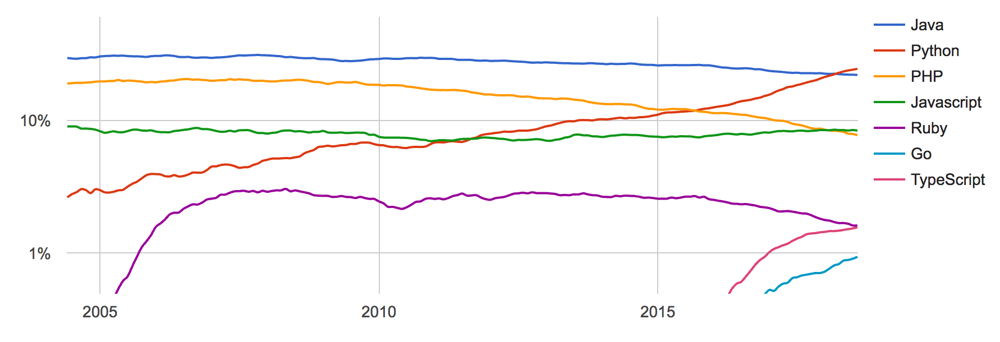

^ 1. Assume nothing
  - start slow, assume nothing about what your audience knows

^  Answer these questions:
  - what is your technology's pedigree (who made it, who supports it, how old is it, who uses it?)
  - what is your connection to it?
  - what other technology is like this?
  - how is this different/better than that?
  - what problems does it solve?
  - what are the disadvantages?
  - what compromises do you have to make?

### **A Little Bit About**
# Typescript

<br>
### Kira McLean

_twitter.com/kiraemclean_
_github.com/kiramclean_

[.footer: **○ ○ ○ ○ ○ ○ ○ ○ ○ ○ ○ ○ ○ ○ ○ ○ ○ ○ ○ ○ ○ ○ ○ ○ ○ ○ ○ ○ ○ ○ ○ ○ ○ ○ ○ ○ ○ ○ ○ ○ ○ ○ ○ ○ ○ ○ ○ ○ ○ ○ ○ ○ ○ ○ ○ ○ ○ ○ ○ ○ ○**]

---

# About Me

 
 

---

# About Me

 
  

---


## _1._ What is it?
## _2._ **Why use it?**
## _3._ How to use it?

---

> What is it?

---

# What is it?

- **Javascript + typing**


^ - open source language built and maintained by microsoft since 2012
- superset of javascript with gradual typing
  + can use all the js libraries that are already out there
  + your JS code is already valid TS
  + compiles to idiomatic JS (doesn't look like it's generated by a machine, looks pretty similar)
  + runs everywhere, like JS
- adds types, classes, and modules
  + makes it easier to develop large apps
  + enables excellent tooling
  + these all disappear at runtime 

---

# What is it?

- **Javascript + typing**

  

^ - angular is written in typescript, also ionic
- used by microsoft, google, also asana, lyft,
- I work mostly with typescript at work
- makes it easier to maintain a large front-end code base
- little bit of a learning curve if you're not familiar with the concept of typed languages, but worth it!

---

# What are types?
<br>

---

# What are types?
<br>


---

**JS**

```js
let x = 5;
x = 'hello' 

// no problem
```

**TS**

```ts
let x = 5;
x = 'hello' 

// Type '"hello"' is not assignable to type 'number'.
```

^ You either say what type the thing is or typescript infers it, but either way it has a type and always has to be that type of thing

---

```ts

function hello(name: string) {
  "Hello" + name
}
```

**JS**

```js
hello('Kira'); 
// no problem
```

**TS**

```ts
hello({ name: 'Kira' }) 
// Argument of type '{ name: string; }' is not assignable 
// to parameter of type 'string'.
```

---

```ts
class ListItem {
  delete() {
    // whatever implementation 
  }
}

const item = new ListItem()
```

**JS**

```js
item.remove()

// At runtime:
// Uncaught TypeError: item.remove is not a function

```

**TS**

```ts
item.remove()

// At compile time:
// Property 'remove' does not exist on type 'ListItem'.
```

^ You either say what type the thing is or typescript infers it, but either way it has a type and always has to be that type of thing
^ what is type safety?
    + the idea is to catch errors earlier, at compile time instead of run time
    + catch errors during development -- ones that are easy to miss and can only be identified by testing a running program

---

> Why use typescript?

---

_Why use typescript?_

<br>

- benefits of JS
- tooling
- next-version features

---

### Popularity of programming languages



_http://pypl.github.io_

^ JS is super popular, you can use all the existing libraries in your typescript projects

---

# Tooling
- Refactoring
- Auto-formattting

^ Because of the typing information, your editor can help you out with things like renaming and refactoring

---

# ES6/ES7 features

---

---
---
---


# Inference vs. Assertion

---

- 

---


- what are types?

- why use it?
    + benefits of JS (huge ecosystem, runs everywhere -- mobile, web, desktop, servers,  but more scalable
    + tooling
        * tsserver integrates with an IDE
        * tslint (community built and maintained, can be because TS is open source)
    + uses latest ES-whatever features (fat arrows, classes, async/await) -- can write TS but target whatever ES version you want (replaces babel)
